# VuePress入门

[[toc]]

## 1.环境准备

1. 需要 `Node.js v18.16.0+`，这里选择了 `Node.js v18.20.4(Long Term Support)`。`nvm install 18.20.4`，下载的时候如果报错可以将代理设为全局试试。
2. `nvm use 18.20.4`
3. 包管理器可选npm、yarn、pnpm，官网举例用的是pnpm，这里便用它。npm install -g pnpm

## 2.创建项目

通过脚手架创建项目（也可以一步步创建，[参考官网](https://vuepress.github.io/zh/guide/getting-started.html#创建项目)）：

`pnpm create vuepress project-name`

这里会有一些选项，其中vite跟webpack之间我选了vite，构建过程中会询问是否添加github工作流(workflows)，这里选择生成这个文件（文件里有个branches要跟项目实际分支对应上，默认为main，我的项目是master就需要在这里改成master）。

## 3.运行项目

`pnpm docs:dev`

如果有警告说版本依赖不对，比如`vuepress` 是2.0.0-rc.14的，那么他需要的 `@vuepress/bundler-vite` 也是这一版本号，但是我通过脚手架安装的是2.0.0-rc.7的，那么就安装一遍那个高版本的 `@vuepress/bundler-vite` （一定要注意当前shell脚本所在目录，我第一次就搞错目录了，又删了重新执行的）

## 4.修改配置

VuePress 站点的基本配置文件是 `.vuepress/config.js`

~~~javascript
import { defaultTheme } from '@vuepress/theme-default'
import { defineUserConfig } from 'vuepress/cli'
import { viteBundler } from '@vuepress/bundler-vite'

export default defineUserConfig({
  lang: 'zh-CN',

  title: 'VuePress',
  description: 'VuePress教程',
  base: "/LearnVuePress/",       //Github 仓库名

  head: [['link', { rel: 'icon', href: '/img/favicon.png' }]],

  theme: defaultTheme({
    logo: '/img/logo.gif',
    locales: {
      '/': {
        lang: 'zh-CN'
      }
    },

    navbar: [
      { text: "首页", link: '/' },
      {
        text: "友链", 
        children: [
          { text: "我的博客", link: "https://fireworks99.github.io/" },
          { text: "我的Github", link: "https://github.com/fireworks99" },
        ]
      }
    ],

    sidebar: [
      "/post/junior",
      "/post/extension"
    ]
  }),

  bundler: viteBundler(),
})

~~~

## 5.生成Token

1. 点击头像，点击`settings`

   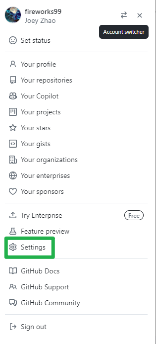

2. 在左侧最底部点击`Developer settings`

   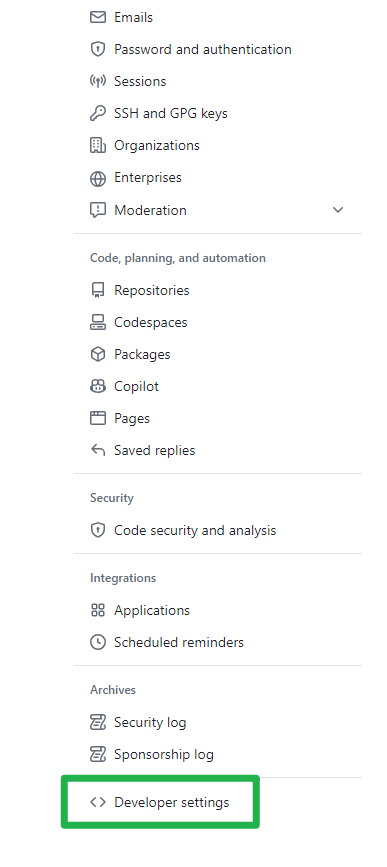

3. 找到经典(classic)的token

   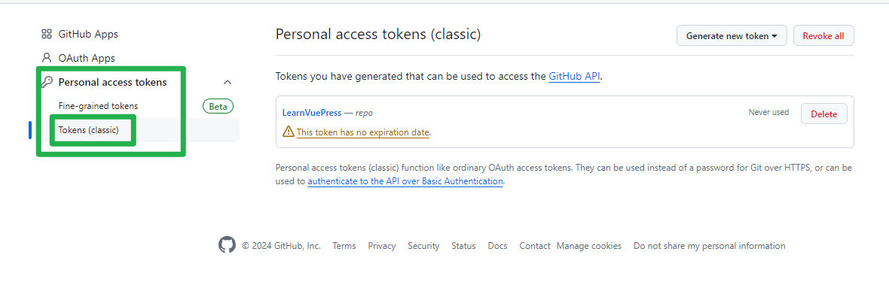

4. 点击生成新token

   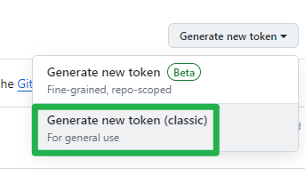

5. 填写名称（与项目相关即可）、有效期（怕麻烦选无期限）、作用范围（repo即可）

   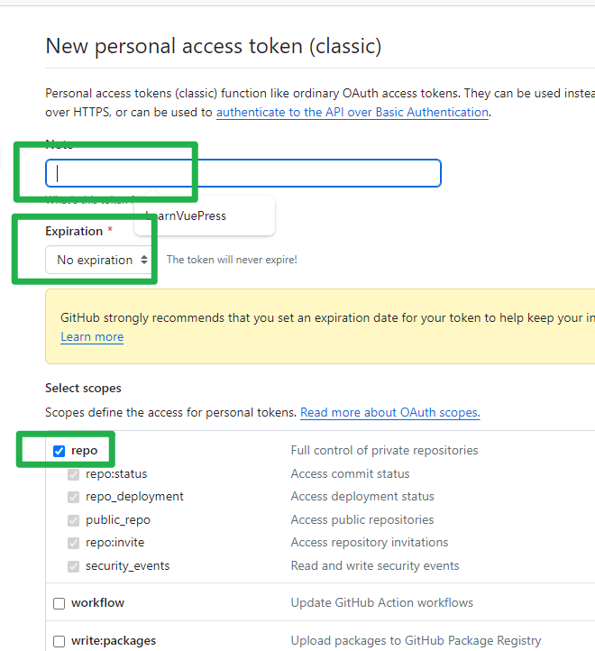

6. 点击`Generate Token`，就会生成一个新的token，这里它只会出现一次，一旦刷新该网页就不见了，所以最好把它复制到你的备忘录备份一下，而且待会也是需要用到这个 Token 的。

结果如下：

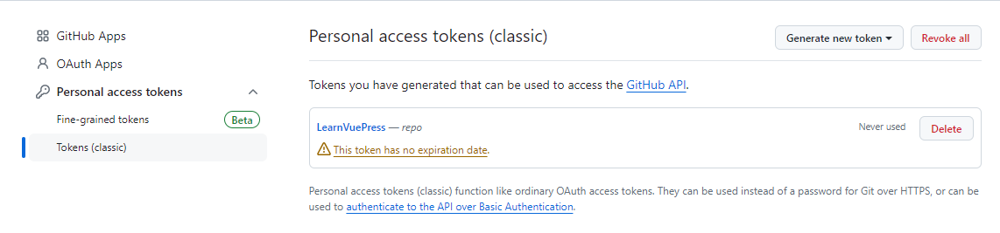

## 6.设置Secrets

1. 到项目仓库中，点击`settings => Secrets and variables => Actions => New repository secret`

   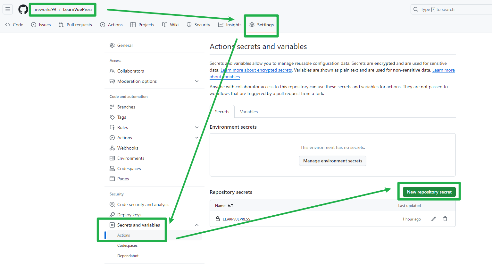

2. 填写secret的信息，其中第二个框填写上一步生成的token

   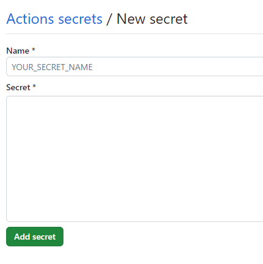

3. 点击`add secret`即可

结果如下：

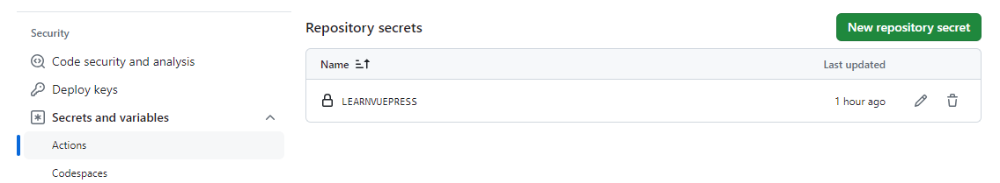

## 7.提交代码

提交本地代码到github仓库，这里注意分支名字问题，github默认为main分支，本地默认为master分支，要处理。

对应的工作流里的branches要写对。

首次提交不会触发CI，第二次提交会触发CI。

> 补充：VuePress脚手架创建的CI工作流可直接拿来用，除了branches要注意外，其他的都不用改。

~~~yml

name: 部署文档

on:
  push:
    branches:
      # 确保这是你正在使用的分支名称
      - master

permissions:
  contents: write

jobs:
  deploy-gh-pages:
    runs-on: ubuntu-latest
    steps:
      - name: Checkout
        uses: actions/checkout@v3
        with:
          fetch-depth: 0
          # 如果你文档需要 Git 子模块，取消注释下一行
          # submodules: true

      - name: 安装 pnpm
        uses: pnpm/action-setup@v2
        with:
          run_install: true
          version: 8

      - name: 设置 Node.js
        uses: actions/setup-node@v3
        with:
          node-version: 20
          cache: pnpm

      - name: 构建文档
        env:
          NODE_OPTIONS: --max_old_space_size=8192
        run: |-
          pnpm run docs:build
          > docs/.vuepress/dist/.nojekyll

      - name: 部署文档
        uses: JamesIves/github-pages-deploy-action@v4
        with:
          # 这是文档部署到的分支名称
          branch: gh-pages
          folder: docs/.vuepress/dist
~~~

## 8.配置Github Pages

CI完成后会将文档部署到`gh-pages`分支

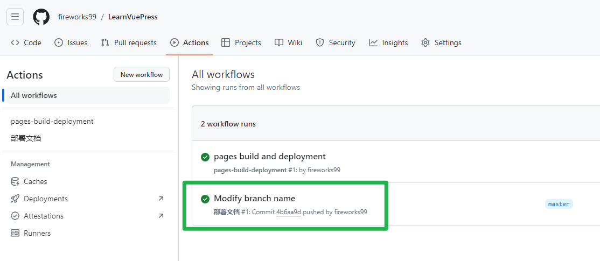

等一会儿，待 gh-pages 分支创建后，来到项目`Settings => Pages`，`Source`选择`Deploy from a branch`，`Branch`选择`gh-pages`，点击Save

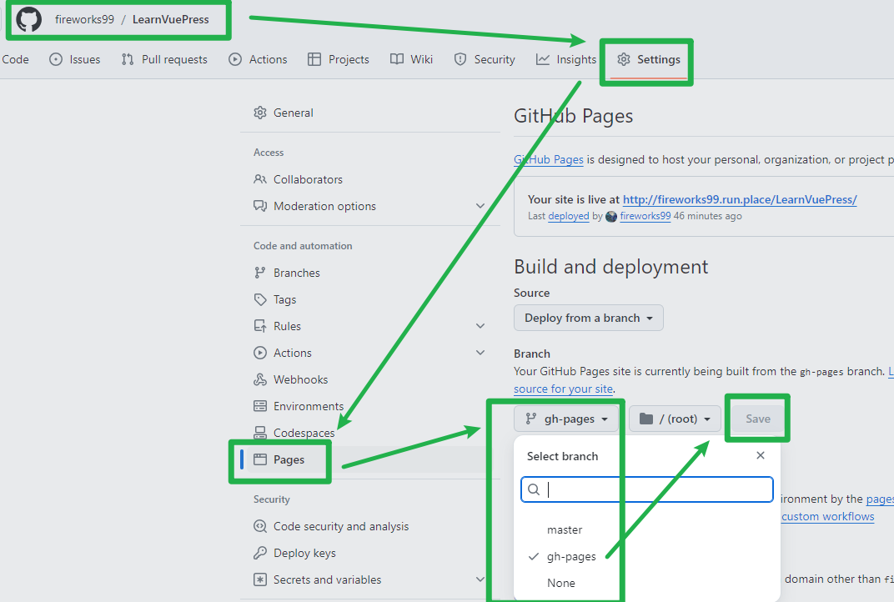

此时来到Actions这里发现又开始运行一个工作流

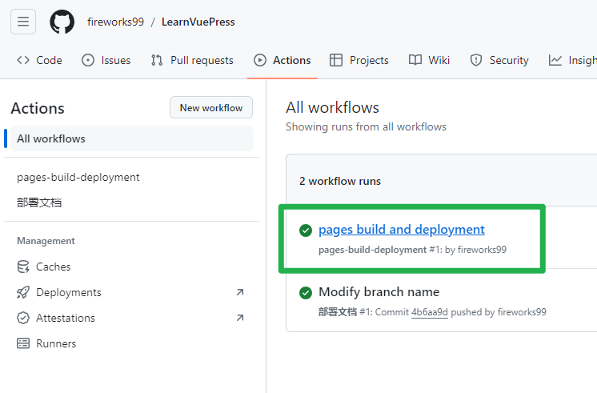

稍等片刻执行完毕，看到 GitHub Pages 站点启动成功，就可以访问网站了！

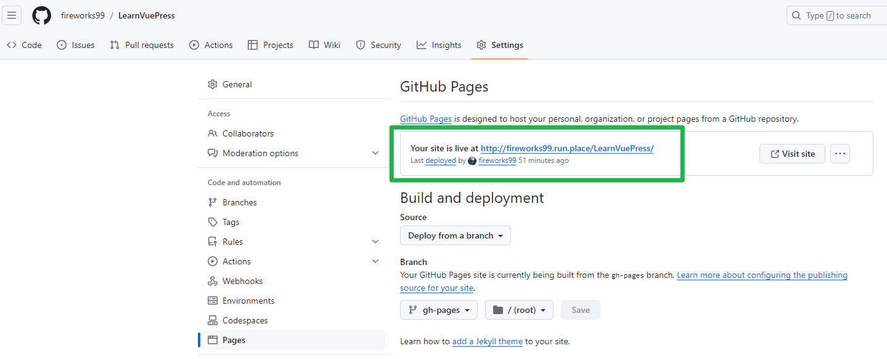

